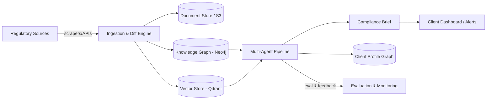

# RegIntel

**Real-time regulatory change-intelligence for regulated SMBs, powered by GraphRAG and a verified multi-agent pipeline.**

RegIntel continuously monitors regulatory sources (FDA, SEC, EPA, OSHA, EU/UK, state agencies), detects clause-level changes, traces multi-hop implications across interlinked regulations using a knowledge graph, and produces compliance briefs with every claim grounded in a verifiable citation.

## Why RegIntel

> "We found out about the new FDA labeling rule three weeks after the deadline — from a fine notice."

Enterprise compliance tooling (Bloomberg Law, Thomson Reuters) costs $50K–$500K/year and is built for legal teams, not operators. SMBs — 33M+ in the US alone — get nothing. RegIntel closes that gap with an AI system that reasons over regulatory graphs the way a compliance lawyer would, but continuously and at a fraction of the cost.

## High-Level Architecture



## Documentation Index

| Doc | Purpose |
|---|---|
| [CLAUDE.md](./CLAUDE.md) | AI coding agent operating guide |
| [PRD.md](./PRD.md) | Product requirements & user stories |
| [ARCHITECTURE.md](./ARCHITECTURE.md) | System design, diagrams, data flow |
| [DATA_PIPELINE.md](./DATA_PIPELINE.md) | Ingestion, diffing, graph-build |
| [AGENTS.md](./AGENTS.md) | Multi-agent design & contracts |
| [EVALUATION.md](./EVALUATION.md) | Eval framework, benchmarks |
| [TECH_STACK.md](./TECH_STACK.md) | Technology choices & rationale |
| [API_SPEC.md](./API_SPEC.md) | REST API reference |
| [DATABASE_SCHEMA.md](./DATABASE_SCHEMA.md) | Postgres + Neo4j + Vector schemas |
| [SECURITY.md](./SECURITY.md) | Threat model, secrets, compliance |
| [DEPLOYMENT.md](./DEPLOYMENT.md) | Infra, CI/CD, environments |
| [ROADMAP.md](./ROADMAP.md) | MVP → V1 → V2 → Production |
| [TASKS.md](./TASKS.md) | Sprint-level task breakdown |
| [RESUME_IMPACT.md](./RESUME_IMPACT.md) | Framing this project for hiring |

## Quickstart

```bash
git clone <repo>
cd regintel
cp .env.example .env.local
docker compose up -d        # Postgres, Neo4j, Qdrant, Redis
make install
make migrate
make seed-demo               # loads a small sample regulation corpus
make run-api
```

Visit `http://localhost:8000/docs` for the API explorer.

## Production Deployment

Phase 4 infrastructure lives under `infra/`:

| Component | Location |
|---|---|
| Terraform (VPC, RDS, ECS, SQS, S3) | `infra/terraform/` |
| Dockerfiles (api, agent-worker, ingestion) | `services/*/Dockerfile` |
| CI/CD workflows | `.github/workflows/` |
| Langfuse (self-hosted) | `infra/langfuse/docker-compose.langfuse.yml` |
| Runbooks | `infra/runbooks/` |
| Security checklist | [docs/SECURITY_CHECKLIST.md](./docs/SECURITY_CHECKLIST.md) |

```bash
# Validate Terraform modules
make terraform-validate

# Build API image locally
docker build -f services/api/Dockerfile -t regintel/api:local .

# Run agent worker (requires SQS_QUEUE_URL)
make run-worker

# E2E smoke tests (local TestClient or remote staging)
make e2e
E2E_BASE_URL=https://staging.example.com make e2e

# Load test (100 concurrent health checks)
make load-test

# Langfuse tracing UI (local)
make langfuse-up
```

Deploy flow: PR → CI (lint/test/audit) → eval gate → build/push ECR → auto-deploy staging → manual approval → production.

See [DEPLOYMENT.md](./docs/DEPLOYMENT.md) for the full topology and SLO targets.

## License

Proprietary (or MIT for portfolio mode — set in `LICENSE`).
