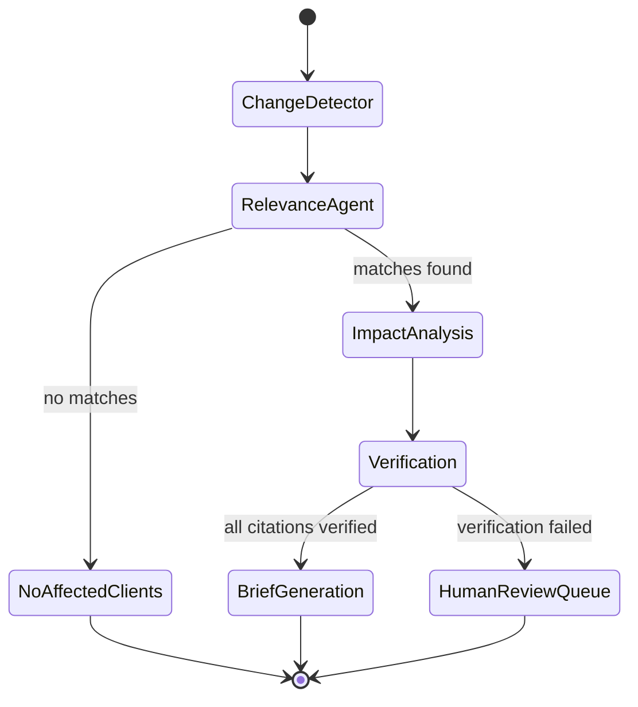

# AGENTS.md

## 1. Overview

RegIntel's reasoning core is a LangGraph state machine with 5 specialized agents. Each agent has a strict input/output contract (Pydantic models) and is independently evaluable (see `EVALUATION.md`).



## 2. Shared State Schema

```python
class PipelineState(TypedDict):
    change_event: ChangeEvent
    affected_profiles: list[AffectedProfile]
    impact_drafts: list[ImpactDraft]
    verified_impacts: list[VerifiedImpact]
    brief: ComplianceBrief | None
    status: Literal["IN_PROGRESS", "COMPLETE", "LOW_CONFIDENCE", "NO_IMPACT"]
    trace: list[AgentTraceEntry]   # for audit
```

## 3. Agent Contracts

### 3.1 Change-Detector Agent
**Trigger**: Diff engine emits a `SUBSTANTIVE`/`CRITICAL` change event.

**Input**:
```python
class ChangeEvent(BaseModel):
    document_id: str
    clause_id: str
    change_type: Literal["ADDED","MODIFIED","REMOVED"]
    severity: Literal["SUBSTANTIVE","CRITICAL"]
    old_text: str | None
    new_text: str | None
    effective_date: date | None
    source: str
```

**Output**: enriched `ChangeEvent` + a normalized `change_summary` (1-2 sentence plain-English description, generated via Haiku-tier LLM).

**Model**: Claude Haiku (cheap, high-volume).

**Failure mode**: If summary generation fails, pass through with `change_summary=None` — downstream agents fall back to raw clause text.

---

### 3.2 Relevance Agent
**Purpose**: Multi-hop graph traversal to find which `ClientProfile` nodes are affected by this change.

**Algorithm**:
1. Find `Regulation`/`Clause` node for `change_event.clause_id`.
2. Traverse `APPLIES_TO` edges (depth ≤ 1) to `BusinessCategory` nodes.
3. Traverse `AMENDS`/`REFERENCES` edges (depth ≤ 3) to find related regulations that also apply to business categories — this is the multi-hop step that catches indirect impacts.
4. Join `BusinessCategory` matches against `ClientProfile.naics_codes` and `OPERATES_IN` jurisdiction matches.
5. Score each match by hop-distance (closer = higher relevance) and apply feedback-derived weights (see §6).

**Output**:
```python
class AffectedProfile(BaseModel):
    client_id: str
    relevance_score: float       # 0-1
    hop_path: list[str]           # graph path of node IDs, for explainability
    matched_categories: list[str]
```

**Model**: No LLM call required for the core traversal (pure Cypher query). An LLM (Haiku) is used only to generate a human-readable explanation of the hop_path for the audit trace.

**Cypher example** (illustrative):
```cypher
MATCH (c:Clause {clause_id: $clause_id})-[:PART_OF]->(r:Regulation)
MATCH (r)-[:AMENDS|REFERENCES*0..3]-(related:Regulation)
MATCH (related)-[:APPLIES_TO]->(bc:BusinessCategory)
MATCH (cp:ClientProfile)-[:CLASSIFIED_AS]->(bc)
MATCH (cp)-[:OPERATES_IN]->(j:Jurisdiction)
WHERE j.code IN $client_states  // pre-filter
RETURN cp.client_id, bc.naics_code, length(path) as hops
```

---

### 3.3 Impact-Analysis Agent
**Purpose**: For each affected profile, retrieve related/downstream regulations and draft an impact analysis. This is the **Corrective RAG** step.

**Process**:
1. Hybrid retrieval (dense + sparse, reranked) over Qdrant for clauses related to `change_event` and the client's specific product/jurisdiction context.
2. If top-k retrieved clauses don't directly address the client's specific category (checked via a relevance-threshold + LLM judge), **reformulate the query** (e.g., add jurisdiction or product-category terms) and re-retrieve — up to 2 reformulation rounds (Corrective RAG loop).
3. **Hard exit**: if after the reformulation rounds the top retrieval score is still below `impact_min_context_score`, return `status="NO_IMPACT"` with empty obligations and **skip the Sonnet call** — weak context is never passed to generation (prevents fabricated connections + saves cost).
4. Otherwise draft impact analysis with inline citations (clause_ids), using retrieved context only — model instructed to never state a requirement without a `[clause_id]` tag, and given an explicit `{"no_impact": true}` escape hatch so it can decline rather than invent a tenuous link.

**Output**:
```python
class ImpactDraft(BaseModel):
    client_id: str
    summary: str
    obligations: list[Obligation]   # each with text + cited clause_ids + deadline
    retrieved_clause_ids: list[str]
    reformulation_rounds: int
    status: Literal["DRAFTED", "NO_IMPACT"]
```

**Model**: Claude Sonnet.

---

### 3.4 Verification Agent (Self-Reflective RAG — hard gate)
**Purpose**: Independently verify every citation in `ImpactDraft` against source text. **No brief is generated without passing this agent.**

**Process**:
1. For each cited `clause_id`, fetch the actual clause text from Neo4j/Postgres (source of truth, not the retrieved chunk from the draft step — independent retrieval).
2. If a cited clause can no longer be fetched (repealed/superseded between Impact-Analysis and Verification), it is recorded as a **`stale_reference`** — distinct from `UNSUPPORTED` (the claim exists but isn't backed). Stale references indicate the draft should be re-run on fresh graph state.
3. LLM judge (separate call, different prompt — "does this clause support this claim?") scores support: `SUPPORTED`, `PARTIALLY_SUPPORTED`, `UNSUPPORTED`.
4. Any `UNSUPPORTED` claim → either (a) attempt one re-retrieval to find a supporting clause, or (b) strip the claim from the draft.
5. Compute overall confidence = (supported claims / total claims). If confidence < `VERIFICATION_THRESHOLD` (default 0.9), set `status = LOW_CONFIDENCE` and route to human review queue instead of brief generation.

**Output**:
```python
class VerifiedImpact(BaseModel):
    client_id: str
    verified_obligations: list[Obligation]
    confidence: float
    unsupported_claims_removed: list[str]
    stale_references: list[str]   # cited clauses that no longer resolve
```

**Model**: Claude Sonnet (different prompt/temperature than Impact-Analysis to reduce correlated errors — "model diversity" verification).

---

### 3.5 Brief-Generation Agent
**Purpose**: Produce the final client-facing compliance memo.

**Output**:
```python
class ComplianceBrief(BaseModel):
    client_id: str
    title: str
    change_summary: str
    severity: str
    obligations: list[Obligation]    # text, deadline, citations
    recommended_actions: list[str]
    citations: list[CitationRef]     # clause_id -> source URL + verbatim text excerpt
    confidence: float
    generated_at: datetime
    disclaimer: str  # standard legal disclaimer, see SECURITY.md
```

**Model**: Claude Sonnet, low temperature, structured output (JSON schema enforced via tool-calling / function-calling).

## 4. LLM Routing Summary

| Agent | Model | Rationale |
|---|---|---|
| Change-Detector | Haiku | High volume, simple summarization |
| Relevance Agent | None (Cypher) + Haiku for explanation | Graph traversal is deterministic |
| Impact-Analysis | Sonnet | Reasoning over retrieved context, Corrective RAG loop |
| Verification | Sonnet (different prompt) | Critical accuracy gate |
| Brief-Generation | Sonnet, structured output | Final deliverable quality |

## 5. Tool Calling / MCP Integration

Agents have access to the following tools via MCP servers (`services/agents/tools/`):

- `graph_query(cypher: str)` — read-only Cypher execution against Neo4j
- `vector_search(query: str, filters: dict)` — hybrid search against Qdrant
- `fetch_clause(clause_id: str)` — exact clause lookup (source of truth, Postgres/Neo4j)
- `fetch_external_source(url: str)` — live verification against eCFR/Federal Register API (used sparingly, rate-limited)

## 6. Feedback Loop

- Users mark briefs/alerts as `RELEVANT` / `NOT_RELEVANT` / `PARTIALLY_RELEVANT`.
- Feedback stored in Postgres `feedback` table, linked to `hop_path` from the Relevance Agent.
- Weekly batch job adjusts per-edge-type traversal weights (e.g., if `REFERENCES` edges at hop-distance 3 produce high false-positive rates for a given `BusinessCategory`, down-weight that traversal pattern).
- V2: replace heuristic weight adjustment with a learned ranking model (LightGBM over graph-path features).

## 7. Long-Term Memory

- Per-client memory store (Postgres `client_memory` table): past briefs, past feedback, previously-flagged-then-resolved issues — used to avoid re-alerting on the same issue and to personalize brief tone/detail level.
- Memory retrieval is injected into Impact-Analysis Agent's context as "previously noted for this client: ...".

## 8. Guardrails Summary

- Output schema enforced via function-calling (no free-form JSON parsing of brittle text).
- Verification Agent is a non-bypassable gate (architecturally enforced — `BriefGeneration` node has no incoming edge except from `Verification` with `status=PASS`).
- Prompt-injection defense: retrieved document text is wrapped in clearly delimited context blocks; agents are instructed to treat document content as data, not instructions (tested in `services/eval/datasets/prompt_injection/`).
- Rate limiting + cost caps per pipeline run (configurable in `services/agents/config.py`).
