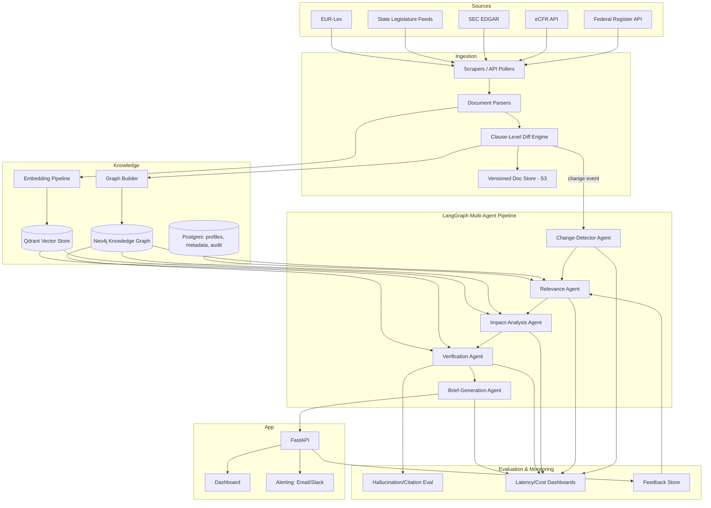
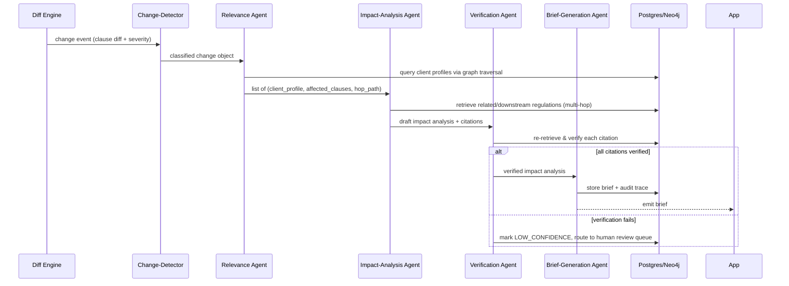
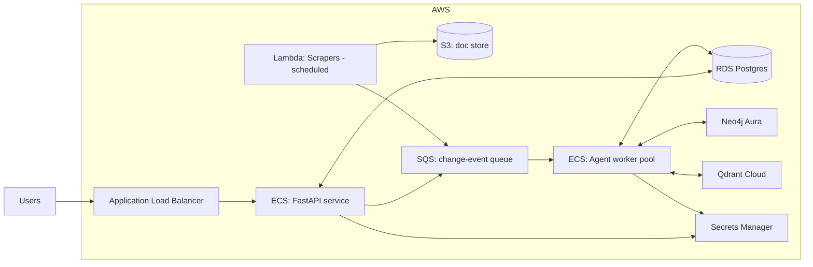

# ARCHITECTURE.md

## 1. System Overview

RegIntel is composed of five major subsystems:

1. **Ingestion & Diff Engine** — pulls regulatory documents, versions them, computes clause-level diffs.
2. **Knowledge Layer** — Neo4j knowledge graph (regulations, clauses, agencies, business categories) + Qdrant vector store (chunk embeddings) + Postgres (client profiles, metadata, audit logs).
3. **Agentic Reasoning Layer** — LangGraph multi-agent pipeline (5 agents, see AGENTS.md).
4. **API & Application Layer** — FastAPI backend, dashboard frontend, alerting (email/Slack).
5. **Evaluation & Monitoring Layer** — citation accuracy eval, hallucination eval, cost/latency dashboards.

## 2. End-to-End Data Flow

## 3. Subsystem Detail

### 3.1 Ingestion & Diff Engine
- Scheduled pollers (Dagster) per source, respecting rate limits / robots.txt.
- Each fetched document is hashed; if hash changes, parse and run clause-level diff against previous version (stored in S3, versioned).
- Diff output: list of `(clause_id, change_type, old_text, new_text, severity)`.
- Severity classification: rule-based heuristics (effective date changes, numeric threshold changes = high severity) + LLM classifier for ambiguous cases.
- Full detail: see `DATA_PIPELINE.md`.

### 3.2 Knowledge Layer
- **Neo4j**: nodes = `Regulation`, `Clause`, `Agency`, `BusinessCategory` (NAICS), `Jurisdiction`, `ClientProfile`. Edges = `AMENDS`, `REFERENCES`, `SUPERSEDES`, `APPLIES_TO`, `OPERATES_IN`.
- **Qdrant**: dense + sparse (hybrid) embeddings of clause-level chunks, with metadata filters (jurisdiction, agency, effective_date, regulation_id).
- **Postgres**: client profiles, users, alert history, feedback, audit trail of agent runs.
- Full schema: see `DATABASE_SCHEMA.md`.

### 3.3 Agentic Reasoning Layer
See `AGENTS.md` for full contracts. High-level flow per detected change:

### 3.4 API & Application Layer
- FastAPI exposes REST endpoints (see `API_SPEC.md`) for profiles, briefs, ad-hoc Q&A, feedback.
- Dashboard (React/Next.js) — out of scope for backend-focused MVP but stubbed.
- Alerting via email (SES) and Slack webhook.

### 3.5 Evaluation & Monitoring
- Citation-accuracy benchmark run on every agent-pipeline change (CI gate).
- Langfuse/LangSmith tracing of all agent runs.
- Cost/latency dashboards (per-agent token usage, $ per brief).
- See `EVALUATION.md`.

## 4. Deployment Topology (summary — see DEPLOYMENT.md)

## 5. Key Architectural Decisions (ADR summary)

| Decision | Rationale | Alternatives Considered |
|---|---|---|
| Neo4j for regulation graph | Native multi-hop traversal, Cypher expressiveness for "amends/references" chains | Postgres recursive CTEs (too slow for deep traversal), RDF triple store (overkill) |
| Qdrant for vectors | Hybrid search (dense+sparse) support, self-hostable, good filtering | Pinecone (cost at scale), Weaviate (similar, Qdrant chosen for simpler ops) |
| LangGraph for agents | Explicit state machine, conditional routing, good for audit trails | CrewAI/AutoGen (less control over state/branching) |
| Diffing at clause level, not document level | Reduces noise, enables severity classification, dramatically cuts re-embedding cost | Whole-document re-embed on any change (expensive, noisy) |
| Verification Agent as hard gate (non-bypassable) | Citation accuracy is the core product guarantee | Trusting single-pass generation (unacceptable hallucination risk) |
