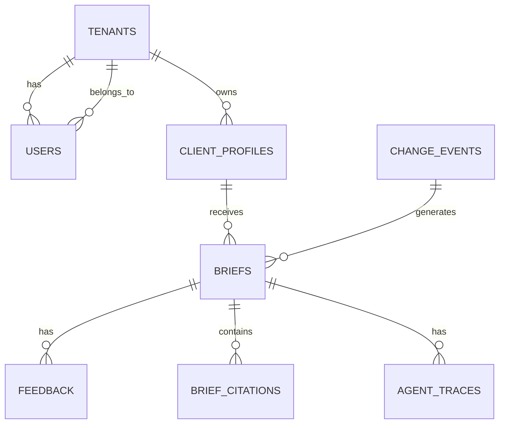

# DATABASE_SCHEMA.md

## 1. Postgres Schema (relational metadata, profiles, audit)



### `tenants`
| Column | Type | Notes |
|---|---|---|
| id | uuid PK | |
| name | text | |
| plan | text | free/pro/enterprise |
| created_at | timestamptz | |

### `users`
| Column | Type | Notes |
|---|---|---|
| id | uuid PK | |
| tenant_id | uuid FK -> tenants.id | |
| email | text unique | |
| hashed_password | text | |
| role | text | admin/consultant/viewer |
| created_at | timestamptz | |

### `client_profiles`
| Column | Type | Notes |
|---|---|---|
| id | uuid PK | mirrored as Neo4j `ClientProfile.client_id` |
| tenant_id | uuid FK | |
| name | text | |
| naics_codes | text[] | |
| states_of_operation | text[] | |
| product_categories | text[] | |
| supply_chain_jurisdictions | text[] | |
| created_at | timestamptz | |
| updated_at | timestamptz | |

### `change_events`
| Column | Type | Notes |
|---|---|---|
| id | uuid PK | |
| document_id | text | |
| clause_id | text | |
| change_type | text | ADDED/MODIFIED/REMOVED |
| severity | text | SUBSTANTIVE/CRITICAL/COSMETIC |
| old_text | text | nullable |
| new_text | text | nullable |
| effective_date | date | nullable |
| source | text | |
| detected_at | timestamptz | |

### `briefs`
| Column | Type | Notes |
|---|---|---|
| id | uuid PK | |
| client_id | uuid FK -> client_profiles.id | |
| change_event_id | uuid FK -> change_events.id | |
| title | text | |
| change_summary | text | |
| severity | text | |
| obligations | jsonb | array of {text, deadline, citation_clause_ids} |
| recommended_actions | jsonb | array of strings |
| confidence | numeric(4,3) | |
| status | text | COMPLETE / LOW_CONFIDENCE / NO_IMPACT |
| disclaimer | text | |
| generated_at | timestamptz | |

### `brief_citations`
| Column | Type | Notes |
|---|---|---|
| id | uuid PK | |
| brief_id | uuid FK -> briefs.id | |
| clause_id | text | references Neo4j Clause.clause_id |
| source_url | text | |
| excerpt | text | verbatim text snapshot at generation time |

### `feedback`
| Column | Type | Notes |
|---|---|---|
| id | uuid PK | |
| brief_id | uuid FK -> briefs.id | |
| user_id | uuid FK -> users.id | |
| rating | text | RELEVANT/NOT_RELEVANT/PARTIALLY_RELEVANT |
| comment | text | nullable |
| created_at | timestamptz | |

### `agent_traces`
| Column | Type | Notes |
|---|---|---|
| id | uuid PK | |
| brief_id | uuid FK nullable | null if pipeline didn't reach brief stage |
| change_event_id | uuid FK | |
| agent_name | text | |
| input_snapshot | jsonb | |
| output_snapshot | jsonb | |
| model_used | text | |
| prompt_version | text | |
| tokens_in | int | |
| tokens_out | int | |
| latency_ms | int | |
| created_at | timestamptz | |

### `llm_usage`
| Column | Type | Notes |
|---|---|---|
| id | uuid PK | |
| trace_id | uuid FK -> agent_traces.id | |
| provider | text | anthropic/openai/voyage/cohere |
| model | text | |
| cost_usd | numeric(10,6) | |
| created_at | timestamptz | |

---

## 2. Neo4j Graph Schema

### Node Labels & Key Properties

| Label | Key Properties |
|---|---|
| `Regulation` | `regulation_id` (unique), `title`, `agency`, `jurisdiction`, `source`, `effective_date` |
| `Clause` | `clause_id` (unique), `text`, `version_hash`, `effective_date` |
| `Agency` | `agency_id` (unique), `name`, `jurisdiction` |
| `BusinessCategory` | `naics_code` (unique), `description` |
| `Jurisdiction` | `code` (unique, e.g. "US-CA", "EU") |
| `ClientProfile` | `client_id` (unique) — mirrors Postgres |

### Relationship Types

| Relationship | From -> To | Properties | Meaning |
|---|---|---|---|
| `PART_OF` | Clause -> Regulation | | clause belongs to regulation |
| `AMENDS` | Regulation -> Regulation | `detected_at` | one regulation amends another |
| `SUPERSEDES` | Regulation -> Regulation | `effective_date` | replacement relationship |
| `REFERENCES` | Clause -> Clause | `confidence` | cross-reference (regex or LLM-extracted) |
| `ISSUED_BY` | Regulation -> Agency | | |
| `APPLIES_TO` | Regulation -> BusinessCategory | `confidence`, `source` (manual/derived) | applicability mapping |
| `OPERATES_IN` | ClientProfile -> Jurisdiction | | |
| `CLASSIFIED_AS` | ClientProfile -> BusinessCategory | | |
| `ENFORCED_IN` | Regulation -> Jurisdiction | | |

### Example Cypher — schema constraints (run via migration)

```cypher
CREATE CONSTRAINT clause_id_unique IF NOT EXISTS FOR (c:Clause) REQUIRE c.clause_id IS UNIQUE;
CREATE CONSTRAINT regulation_id_unique IF NOT EXISTS FOR (r:Regulation) REQUIRE r.regulation_id IS UNIQUE;
CREATE CONSTRAINT client_id_unique IF NOT EXISTS FOR (cp:ClientProfile) REQUIRE cp.client_id IS UNIQUE;
CREATE CONSTRAINT naics_unique IF NOT EXISTS FOR (bc:BusinessCategory) REQUIRE bc.naics_code IS UNIQUE;
CREATE INDEX clause_effective_date IF NOT EXISTS FOR (c:Clause) ON (c.effective_date);
```

---

## 3. Qdrant Collection Schema

**Collection**: `clauses_v1`

```json
{
  "vectors": {
    "dense": {"size": 1024, "distance": "Cosine"},
    "sparse": {"modifier": "idf"}
  },
  "payload_schema": {
    "clause_id": "keyword",
    "regulation_id": "keyword",
    "agency": "keyword",
    "jurisdiction": "keyword",
    "effective_date": "datetime",
    "version_hash": "keyword",
    "is_current": "bool",
    "business_categories": "keyword[]"
  }
}
```

- Point ID = deterministic hash of `clause_id + version_hash`, so a new clause version creates a new point rather than overwriting the old one.
- **Supersede on upsert**: before inserting a new version, all existing points for the same `clause_id` are flipped to `is_current=false` (`supersede_old_versions` in `services/retrieval/embeddings.py`). New points are written with `is_current=true`.
- Filters applied at query time: `jurisdiction`, `business_categories`, `effective_date <= now()`, and `must_not is_current=false` (excludes superseded versions while remaining backward-compatible with legacy points that predate the flag).

## 4. Migrations

- Postgres: Alembic, `services/api/migrations/`.
- Neo4j: versioned Cypher migration scripts in `services/graph/migrations/`, applied via a small custom runner (`scripts/run_graph_migrations.py`) that tracks applied versions in a `_migrations` node.
- Qdrant: collection creation/config scripts in `services/retrieval/migrations/`, idempotent (check-then-create).
