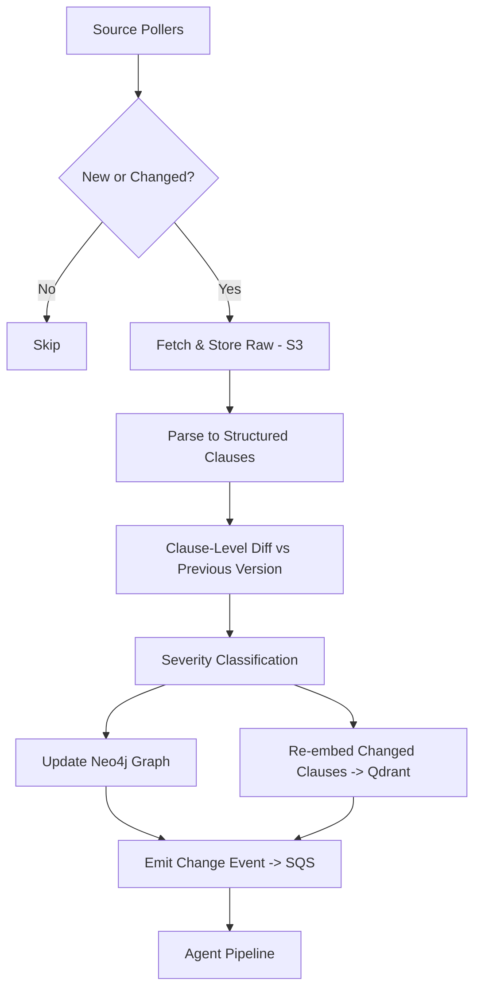

# DATA_PIPELINE.md

## 1. Overview

The data pipeline is responsible for: discovering new/updated regulatory documents, parsing them into structured clauses, computing clause-level diffs, classifying change severity, updating the knowledge graph, and (re)embedding changed chunks.



## 2. Source Adapters (V1 scope)

| Source | Type | Update Frequency | Notes |
|---|---|---|---|
| eCFR API | REST/XML | Daily | Codified federal regulations (e.g., 21 CFR for FDA) |
| Federal Register API | REST/JSON | Daily | Proposed/final rules, notices |
| State legislature site (e.g., CA) | HTML scrape | Weekly | Requires per-state scraper module |
| SEC EDGAR (V2) | REST | Daily | For fintech vertical |
| EUR-Lex (V2) | REST/XML | Weekly | EU jurisdiction |

Each adapter implements the `SourceAdapter` interface:

```python
class SourceAdapter(Protocol):
    source_id: str
    def list_updates(self, since: datetime) -> list[DocumentRef]: ...
    def fetch(self, ref: DocumentRef) -> RawDocument: ...
```

Adapters live in `services/ingestion/adapters/<source_id>.py`. New adapters must include a fixture-based test in `tests/unit/ingestion/adapters/`.

## 3. Parsing

- Raw documents (HTML/XML/PDF) are converted into a structured `ParsedDocument`:

```json
{
  "document_id": "ecfr-21-101-2026-06-01",
  "source": "ecfr",
  "title": "21 CFR Part 101 - Food Labeling",
  "effective_date": "2026-06-01",
  "clauses": [
    {"clause_id": "101.9(c)(1)", "text": "...", "parent_id": "101.9(c)"}
  ]
}
```

- Parsers normalize clause numbering schemes per agency (CFR sections, Federal Register docket clauses, state code sections) into a canonical `clause_id` format: `{source}:{part}:{section}:{subsection}`.
- PDF parsing uses the `pdf` skill tooling (pdfplumber/PyMuPDF) for state documents without structured APIs.

## 4. Clause-Level Diff Engine

- For each `document_id`, compare the new `ParsedDocument.clauses` against the latest stored version (keyed by `clause_id`).
- Diff types: `ADDED`, `REMOVED`, `MODIFIED`, `UNCHANGED`.
- For `MODIFIED`, compute a text diff (difflib) and a semantic-similarity score (embedding cosine) to distinguish cosmetic edits (typos, formatting) from substantive edits.

### Severity Classification

Rule-based first pass:
- Effective-date change, numeric threshold change, new compliance deadline → `CRITICAL`
- New obligation/requirement language detected (regex + keyword heuristics: "shall", "must", "required by") → `SUBSTANTIVE`
- Formatting/typo only (semantic similarity > 0.98) → `COSMETIC`

LLM fallback (Haiku-tier) classifies ambiguous cases (semantic similarity 0.85–0.98) with structured output:

```json
{"severity": "SUBSTANTIVE", "reasoning": "...", "confidence": 0.81}
```

Only `SUBSTANTIVE` and `CRITICAL` changes emit a change event to the agent pipeline. `COSMETIC` changes update the graph/vector store silently (for retrieval freshness) but don't trigger alerts.

## 5. Knowledge Graph Build

For each parsed/diffed document:
1. Upsert `Regulation` node (one per document/part).
2. Upsert `Clause` nodes (one per clause_id), with properties: `text`, `effective_date`, `version_hash`.
3. Create/update edges:
   - `(:Clause)-[:PART_OF]->(:Regulation)`
   - `(:Regulation)-[:AMENDS]->(:Regulation)` — detected via explicit cross-reference parsing (regex for "amends 21 CFR ...", "see also ...")
   - `(:Clause)-[:REFERENCES]->(:Clause)` — cross-references within/across documents
   - `(:Regulation)-[:APPLIES_TO]->(:BusinessCategory)` — derived from agency scope + NAICS mapping table (seeded manually for V1, ML-assisted in V2)
4. Cross-reference extraction: regex patterns for common citation formats (`\d+ CFR \d+\.\d+`, `Section \d+`, "Pub. L. No...") + LLM-assisted extraction for free-text references (batch job, cached).

## 6. Embedding Pipeline

- Chunking: clause-level (no further splitting unless clause > 512 tokens, then recursive split with 50-token overlap).
- Embedding model: `voyage-law-2` (or BGE-large fallback) — see `TECH_STACK.md`.
- Sparse representation: BM25 index (Qdrant supports hybrid) built from clause text.
- Re-embedding triggered only for `ADDED`/`MODIFIED` clauses (cost control).
- Metadata stored alongside vectors: `clause_id, regulation_id, jurisdiction, agency, effective_date, version_hash`.

## 7. Client Profile Mapping

`ClientProfile` (Postgres + mirrored as Neo4j node):
```json
{
  "client_id": "uuid",
  "name": "Acme Foods Inc.",
  "naics_codes": ["311412"],
  "states_of_operation": ["CA", "TX"],
  "product_categories": ["frozen seafood", "ready-to-eat meals"],
  "supply_chain_jurisdictions": ["MX", "CA-state"]
}
```
Edge: `(:ClientProfile)-[:OPERATES_IN]->(:Jurisdiction)`, `(:ClientProfile)-[:CLASSIFIED_AS]->(:BusinessCategory)`.

## 8. Scheduling & Orchestration

- Dagster jobs: `poll_source(source_id)` (per source, scheduled), `process_document(document_id)` (triggered), `rebuild_graph_indices()` (nightly).
- Idempotency: all jobs keyed by content hash; re-runs are no-ops if hash unchanged.
- Failure handling: failed jobs alert via PagerDuty/Slack; partial failures (one clause fails parsing) don't block the rest of the document.

## 9. Data Quality Checks

- Schema validation (Pydantic) on every `ParsedDocument` before graph write.
- Orphan-clause check (clauses with no `PART_OF` edge) — nightly report.
- Cross-reference resolution rate tracked as a metric (target >90% of detected references resolve to existing nodes).
