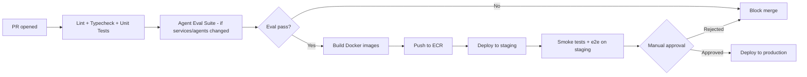

# DEPLOYMENT.md

## 1. Environments

| Env | Purpose | Infra |
|---|---|---|
| `local` | Development | docker-compose (Postgres, Neo4j, Qdrant, Redis), API run via `uvicorn --reload` |
| `staging` | Pre-prod validation, eval runs against near-real data | AWS (smaller instance sizes), Neo4j Aura Free/Pro tier, Qdrant Cloud free tier |
| `production` | Live system | AWS (full sizing), Neo4j Aura Pro, Qdrant Cloud dedicated |

## 2. Infrastructure as Code

- Terraform modules in `infra/terraform/`:
  - `network/` — VPC, subnets, security groups
  - `database/` — RDS Postgres
  - `compute/` — ECS cluster, task definitions, ALB
  - `queue/` — SQS queues
  - `storage/` — S3 buckets (versioned, lifecycle policies)
  - `secrets/` — Secrets Manager entries (values injected via CI, not committed)
- `terraform plan` required on every infra PR; `terraform apply` gated to `main` branch via GitHub Actions with manual approval for production.

## 3. CI/CD Pipeline (GitHub Actions)



### Pipeline Stages (`.github/workflows/`)

1. **`ci.yml`**: lint (`ruff`, `black --check`), `mypy --strict`, `pytest tests/unit`.
2. **`eval.yml`**: triggered on changes to `services/agents/**` or `services/retrieval/**`; runs `make eval-pipeline`, posts report as PR comment, fails if citation accuracy regresses >2%.
3. **`build.yml`**: builds Docker images for `api`, `agent-worker`, `ingestion`, pushes to ECR with commit-SHA tags.
4. **`deploy-staging.yml`**: auto-deploys `main` to staging after build success; runs `tests/e2e` against staging.
5. **`deploy-prod.yml`**: manual-approval gated; deploys tagged release to production ECS services (rolling update).

## 4. Containerization

- Multi-stage Dockerfiles per service (`services/<name>/Dockerfile`): builder stage (install deps), runtime stage (slim image, non-root user).
- Base image: `python:3.12-slim`.
- Health check endpoints: `/healthz` (liveness), `/readyz` (readiness — checks DB/Neo4j/Qdrant connectivity).

## 5. ECS Service Topology

| Service | Type | Scaling | Notes |
|---|---|---|---|
| `api` | ECS Fargate service, behind ALB | Auto-scale on CPU/request count, min 2 tasks | FastAPI app |
| `agent-worker` | ECS Fargate service, consumes SQS | Auto-scale on queue depth | Runs LangGraph pipeline per change event |
| `ingestion-scheduler` | Lambda (EventBridge cron) | N/A | Polls sources, enqueues processing jobs |
| `dagster-daemon` | ECS Fargate (single task) | Fixed | Orchestrates ingestion DAGs |
| `langfuse` | ECS Fargate (self-hosted) | Fixed | Tracing/observability UI |

## 6. Database Migrations in Deploy

- Migrations run as a one-off ECS task (`migrate` task definition) before the new `api` task definition is deployed — part of `deploy-*.yml`.
- Neo4j/Qdrant migration scripts run similarly as one-off tasks; idempotent by design.

## 7. Rollback Strategy

- ECS rolling deploys retain previous task definition revision — rollback = redeploy previous revision (single command/`gh workflow` dispatch).
- Database migrations are additive-first (avoid destructive migrations in the same release as code that depends on them) — follow expand/contract pattern.
- Prompt/model version rollback: prompts versioned in code, so rollback is a code revert; agent_traces record prompt_version for forensic comparison.

## 8. Monitoring & Alerting in Production

- CloudWatch alarms: ECS service health, RDS CPU/connections, SQS queue depth (backlog alert), Lambda error rates.
- Langfuse dashboards: per-agent latency, token usage, error rates.
- PagerDuty/Slack integration for: ingestion staleness (>48h), citation-accuracy sampled-eval drop (<90%), LOW_CONFIDENCE rate spike.

## 9. Cost Controls

- Per-tenant and global daily cost caps enforced in `llm_client.py` (circuit breaker — falls back to cached/"system busy" response if exceeded).
- Reserved/Savings Plans for steady-state ECS compute once usage patterns stabilize.
- Qdrant/Neo4j sizing reviewed monthly against actual corpus growth.

## 10. Local Development Setup

```bash
docker compose up -d        # postgres, neo4j, qdrant, redis
make install                 # poetry install / pip install -e .
make migrate                 # alembic + neo4j + qdrant migrations
make seed-demo               # loads sample regulation corpus (food labeling, CA)
make run-api                 # uvicorn services.api.main:app --reload
make run-worker              # local agent worker consuming local SQS-equivalent (e.g., ElasticMQ)
```
