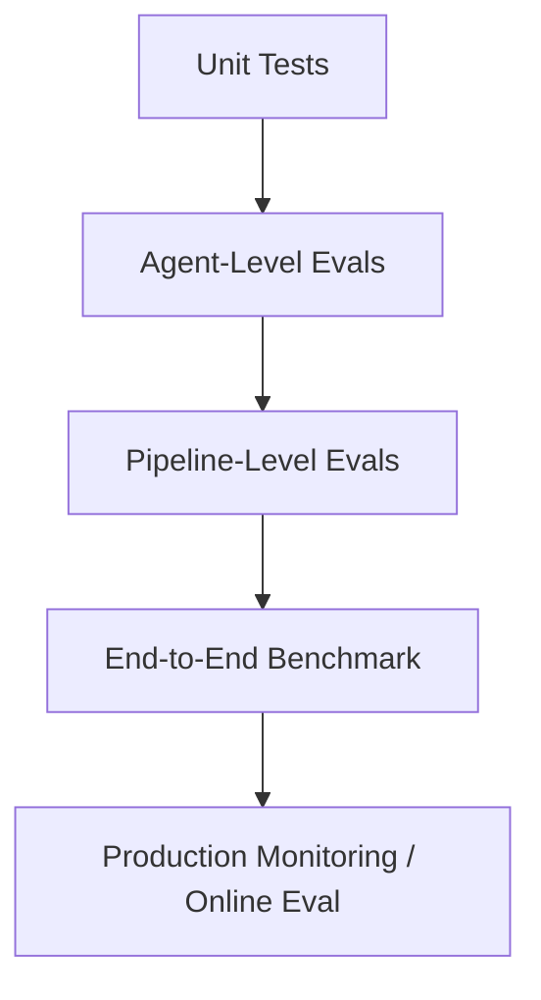

# EVALUATION.md

## 1. Evaluation Philosophy

For RegIntel, **the eval suite is part of the product**, not an afterthought. Citation accuracy and hallucination rate are the core trust metrics — they gate every deployment.

## 2. Evaluation Layers

### 2.1 Unit Tests
Standard pytest unit tests for parsers, diff engine, graph queries. Run on every commit.

### 2.2 Agent-Level Evals
Each agent has a labeled dataset in `services/eval/datasets/<agent_name>/`:

| Agent | Dataset | Metric | Target |
|---|---|---|---|
| Change-Detector | 200 labeled clause diffs (severity-labeled by human reviewers) | Severity classification accuracy | ≥90% |
| Relevance Agent | 100 (change, client_profile) pairs with ground-truth relevance | Precision / Recall on affected-profile detection | Precision ≥85%, Recall ≥90% |
| Impact-Analysis | 100 (change, profile) → expected obligations | ROUGE/semantic similarity to gold obligations + citation presence | Citation presence 100% (every obligation must cite) |
| Verification | Adversarial set: drafts with deliberately injected unsupported claims | Detection rate of unsupported claims | ≥95% |
| Brief-Generation | Full briefs vs. human-written gold briefs | Structured-output schema validity (100%), content quality (LLM-judge rubric) | Schema validity 100% |

### 2.3 Pipeline-Level Evals (Citation Accuracy Benchmark — the headline metric)

**Definition**: For every citation `[clause_id]` in a generated brief, verify that the claim it supports is actually entailed by the verbatim text of `clause_id`.

**Process**:
1. Run pipeline on a held-out set of 50 historical regulatory changes with known downstream client impacts (curated/labeled by domain expert or via careful manual research).
2. For each citation in the output, run an entailment check: `(claim, clause_text) -> {ENTAILED, NOT_ENTAILED}` — using a separate LLM-judge call AND a sample manually reviewed (10% sample, human-in-the-loop) to calibrate the judge.
3. **Citation Accuracy** = ENTAILED citations / total citations.
4. **Target: ≥95%.** Below 90% blocks deployment (CI gate).

### 2.4 Hallucination Benchmark (Adversarial)

A curated set of "trap" scenarios designed to induce hallucination:
- Ambiguous client profiles where no regulation actually applies (correct answer: "no impact found")
- Clauses that reference non-existent regulations (testing graph-traversal robustness)
- Near-duplicate clauses with subtly different numeric thresholds (testing retrieval precision)

**Metric**: Rate of confident-but-incorrect outputs (target: <2%). Any confident-but-incorrect output on this set is a release blocker.

### 2.5 End-to-End Benchmark

Full pipeline run on the "golden set" (50 historical changes), comparing:
- Generated briefs vs. gold-standard briefs (written/reviewed by a compliance professional during dataset curation)
- Metrics: citation accuracy, relevance precision/recall, severity classification accuracy, latency (p50/p95), cost per brief

Run on every PR that touches `services/agents/` (CI), and nightly against the live graph (staleness check).

## 3. Evaluation Frameworks/Tools

- **Ragas** — retrieval/generation metrics (context precision, faithfulness) for Impact-Analysis Agent.
- **Custom entailment harness** — for citation-accuracy (Ragas faithfulness alone insufficient for clause-level legal entailment; custom prompts + human calibration sample).
- **LangSmith / Langfuse** — tracing, dataset versioning, regression comparison across model/prompt versions.
- **pytest + pytest-benchmark** — latency/perf regression.

## 4. Online Evaluation / Monitoring

| Metric | Source | Alert Threshold |
|---|---|---|
| Citation accuracy (sampled, 5% of production briefs, async LLM-judge) | Production pipeline | < 90% → page on-call |
| LOW_CONFIDENCE rate | Verification Agent output | > 20% sustained → investigate retrieval/graph quality |
| False-positive rate (user feedback) | Feedback table | > 15% rolling 7-day → relevance-agent review |
| Per-brief cost | Token usage logs | > $1.00 avg → routing review |
| Pipeline latency p95 | Tracing | > 30s → perf investigation |
| Graph staleness (time since last successful ingestion per source) | Dagster job status | > 48h → ingestion pipeline alert |

## 5. Dataset Governance

- Eval datasets versioned in `services/eval/datasets/` with a `CHANGELOG.md` per dataset.
- Golden-set briefs require sign-off (recorded in dataset metadata) — even in a portfolio project, document your "expert review" process (can be self-reviewed with documented methodology + cross-checked against actual agency guidance documents).
- No eval dataset overlaps with training data for any fine-tuned component (N/A for V1 — no fine-tuning planned, but documented for future-proofing).

## 6. Regression Policy

Any PR that:
- Changes a prompt in `services/agents/`
- Changes retrieval parameters (top-k, reranker model, chunking)
- Changes the graph traversal query in Relevance Agent

...must run `make eval-pipeline` and attach the resulting report (`services/eval/results/<run_id>/report.md`) to the PR. A drop of >2% in citation accuracy vs. the baseline blocks merge without explicit override + justification.
